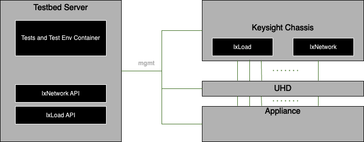

# High Availability Test Plan

- [High Availability Test Plan](#high-availability-test-plan)
    - [Overview](#overview)
        - [Scope](#scope)
        - [Keysight Testbed](#keysight-testbed)
    - [Topology](#topology)
        - [Configuration for SmartSwitch Testing](#configuration-for-smartswitch-testing)
    - [Setup configuration](#setup-configuration)
    - [Test Methodology](#test-methodology)
    - [Test cases](#test-cases)
        - [Test case # 1 - Link Loss](#test-case1-link-loss)
            - [Test objective](#test-objective)
            - [Test steps](#test-steps)
            - [Test results](#test-results)
        - [Test case # 2 – DPU Loss](#test-case2-dpuloss)
            - [Test objective](#test-objective-1)
            - [Test steps](#test-steps-1)
            - [Test results](#test-results-1)
        - [Test case # 3 – Tor Loss](#test-case3-tor-loss)
            - [Test objective](#test-objective-2)
            - [Test steps](#test-steps-2)
            - [Test results](#test-results-2)

## Overview
The purpose of these tests is to evaluate various High Availability (HA) scenarios associated with testing planned and unplanned events in the SmartSwitch system.

### Scope
These tests are targeted on a fully functioning SmartSwitch system. We will be measuring the system as a whole while evaluating HA scenarios such as 100% link loss, DPU, and Grey failover.

### Keysight Testbed
Tests will run on the following testbeds.

## Topology
### Configuration for HA testing

## Setup Configuration
Two DPUs will use similar network configurations (VxLAN, ENI) forming an HA set.  One DPU will be designated as the Active the second Standby.

## Test Methodology
Following test methodology will be used for measuring HA switchover and performance.
* Traffic generator will be used to configure ENI peering between DPU ports.
* Data traffic will be sent from  server to server, server to T1 and T1 to server.
* Depending on the test case, switchovers/failovers will be generated and measured.
* Switchover between DPUs will be measured by noting down the precise time of the switchover/failover event.  Traffic generator will create those timestamps and provide us with the recovery statistics.
* HERE...In order to measure the control plane downtime convergence, we will be pinging the DUT loopback interface to measure how long it takes to respond back to the ping once it comes back online.
* HERE...Similarly for measuring protocol downtime convergence can be neasured for concerned protocol, in this case it is BGP by polling the state of the protocol. 

## Test cases
### Test case1 Link Loss
#### Test Objective

#### Test steps
* In this scenario we will test the switchover between an Active DPU to it's paired Standby DPU.
* Configure network between HA sets with same traffic types within same ENIs.
* Verify links are up and start all protocols and verify traffic is established.
* Apply and start traffic stateful and stateless.
* Verify traffic is flowing without any loss.
* Enable csv logging and check the state of the DPUs through the API.
* Through mgmt port remove port 2 link connection from the Active DPU.
* Mark start time at beginning of test.
* Mark time when the Standby DPU becomes Active and fully running traffic.

### Test case2 DPULoss
#### Test Objective

#### Test steps
* In this scenario we will test the switchover between an Active DPU to it's paired Standby DPU.
* Configure network between HA sets with same traffic types within same ENIs.
* Verify links are up and start all protocols and verify traffic is established.
* Apply and start traffic stateful and stateless.
* Verify traffic is flowing without any loss.
* Enable csv logging and check the state of the DPUs through the API.
* Through mgmt port poweroff or reboot Active DPU.
* Mark start time at beginning of test.
* Mark time when the Standby DPU becomes Active and fully running traffic.

### Test case3 ToR Loss
#### Test Objective

#### Test steps
* In this scenario we will test the switchover between an Active DPU to it's paired Standby DPU.
* Configure network between HA sets with same traffic types within same ENIs.
* Verify links are up and start all protocols and verify traffic is established.
* Apply and start traffic stateful and stateless.
* Verify traffic is flowing without any loss.
* Enable csv logging and check the state of the DPUs through the API.
* Through mgmt port poweroff or reboot Tor1.
* Mark start time at beginning of test.
* Mark time when the Standby DPU becomes Active and fully running traffic.
